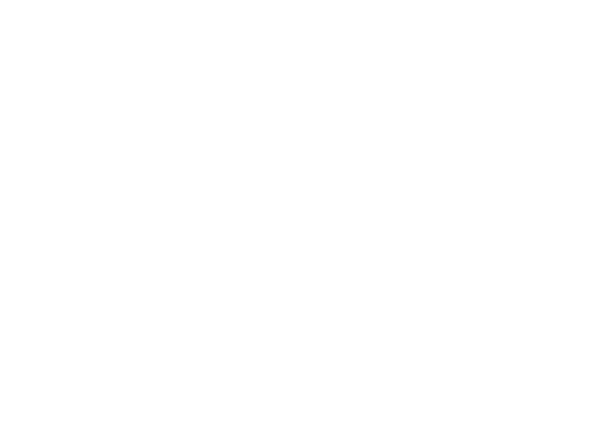

<p align="center">
  
</p>

<h1 align="center">Cut up to 99% of intercepted tokens.<br/>Free.</h1>

<p align="center">
  <strong>NUXS is universal context compression for AI agents.</strong><br/>
  Compresses HARs, huge JSONs, slow query logs, codebases, RAG chunks — <em>before</em> the agent reads them.<br/>
  Provider-agnostic: Claude, Cursor, Codex, Cline, Aider, any MCP-compatible agent.
</p>

<p align="center">
  <a href="https://nuxs.ai/playground"><strong>🟢 Try it in the browser (free, no signup)</strong></a> ·
  <a href="https://nuxs.ai/download"><strong>⬇️ Install the CLI (free beta)</strong></a> ·
  <a href="https://nuxs.ai/benchmark">📊 Benchmark UI</a>
</p>

**Get a free license at [nuxs.ai/register](https://nuxs.ai/register?next=/painel)** — the panel hands you a one-click installer (macOS · Windows · Linux) and your license. The free tier is metered (50M tokens lifetime · 3 devices), so the install is tied to an account from day one.

> **91.62%** weighted margin over **626,784,439 cumulative auditable tokens** · current run **95.42%** (200M, v0.5.33) · up to **99%** on log/api/build/RAG capsules · tokenizer: `cl100k_base`.
> Every metric in this repo is recomputable from the published raw files. Full consolidated study: **[BENCHMARK-626M.md](BENCHMARK-626M.md)**.

---

## Try it before reading anything else

The fastest way to understand NUXS is to feed it your own context and watch the compression happen.

- **Playground** — paste a HAR, a JSON payload, a slow query log, a code dump or pick one of the sample fixtures: **[nuxs.ai/playground](https://nuxs.ai/playground)**
- **Benchmark UI** — explore the report inline with sortable tables: **[nuxs.ai/benchmark](https://nuxs.ai/benchmark)**
- **Install the CLI** — sign up for a free license, the panel hands you a one-click installer wired into Claude Code, Cursor, Cline or any MCP-compatible agent: **[nuxs.ai/register](https://nuxs.ai/register?next=/painel)**

---

## What is NUXS

NUXS is a context compression layer that sits between an AI agent and the model. It reduces the input — conversation history, logs, schemas, diffs, code, search results, and other agent context — before it reaches the model, returning a smaller, denser, cheaper input. NUXS is provider-agnostic and works with Claude, Cursor, Codex, Cline, Aider, or any integration via SDK or proxy, using your own key.

The product is organized into **17 text capsules** — **11 algorithmic** (log, api, network, schema, codebase, diff, test, build, apispec, prompt, image) and **6 LLM-based** (rag, sql, stack, threads, events, pdf) — plus **3 multimodal capabilities** (image-LLM, video, meeting) that translate media into dense textual context.

---

## How it works (pricing & access)

NUXS is in **open beta** and the CLI is **free to install and use** while we validate with early users. Concretely:

- **Free playground** (`nuxs.ai/playground`) — algorithmic capsules run in-browser. No signup needed. Soft cap per IP to keep it open to everyone.
- **Free CLI beta** — get a free license at **[nuxs.ai/register](https://nuxs.ai/register?next=/painel)**, the panel hands you the installer (macOS · Windows · Linux). The hook wires itself into every MCP-compatible agent on the device. Current cap: **50M tokens lifetime · 3 devices**. No card required.
- **Paid tiers** (Solo / Team / Enterprise) lift the monthly cap, raise the device limit, and unlock the LLM-based capsules and multimodal capabilities at scale. Details on `nuxs.ai`.

The 11 algorithmic capsules are deterministic and run entirely on-device. The 6 LLM-based capsules call a model — by default the NUXS-managed proxy, optionally your own key.

---

## Roadmap & openness

We believe the auditable surface of NUXS should be **as open as possible without giving away the engine that pays the bills**. Today that means:

- **Open**: the full benchmark dataset (this repository), the technical report, the manifesto, the website, the playground sample fixtures, and the CLI distribution on npm.
- **Considered for the future**: open-sourcing the **algorithmic** capsules under a permissive license once the product is stable. The LLM-based capsules and the routing engine are expected to remain proprietary for the foreseeable future.

Nothing here is a commitment to a specific date — these are the directions we're walking. If you want to influence the order, open an issue or write to us via `nuxs.ai`.

---

## Headline numbers

| Metric | Value |
|---|---:|
| Cumulative audited volume | **626,784,439** tokens |
| Cumulative tokens saved | **574,252,194** |
| Weighted margin (cumulative) | **91.62%** |
| Current run (200M, v0.5.33) | **95.42%** · zero errors / 9,333 samples |
| Profile — TEXT (RAG/log) | **95.57%** |
| Profile — CODE (coding agent) | **95.27%** |
| Taxonomy | **11 algorithmic + 6 LLM + 3 multimodal** |
| Full consolidated study | **[BENCHMARK-626M.md](BENCHMARK-626M.md)** |

All numbers measured with `cl100k_base` via the public `gpt-tokenizer` package. Full per-capsule and per-run breakdown in **[BENCHMARK-626M.md](BENCHMARK-626M.md)**.

---

## How to read the numbers

The aggregate published is a **floor**, not a ceiling. Most of the study uses seeded synthetic inputs with high entropy and low redundancy — deliberately designed to measure the worst case. Real inputs carry natural redundancy that synthetic does not reproduce, and consistently compress more. Where direct comparison with real data is available, the report shows structural capsules climbing from synthetic to real:

| Capsule | Synthetic | Real |
|---|---:|---:|
| codebase | 73.1% | 78.2% / 95.2% * |
| diff | 71.7% | ~79% |
| schema | 45.3% | ~67% |
| log / api / build | already at ceiling | ~99% |

\* Two reproducible criteria for codebase in real use: 78.2% over the full universe of 6,050 files (lower auditable bound), and 95.2% over a deterministic top-40 of the largest production files (typical hook regime). Both have raw published.

Capsules with lower aggregate margin (schema, pdf) correspond to data types with high informational density — every element is signal and there is no significant redundancy to discard without loss. These technical ceilings are documented in the report.

---

## Reproducing the metrics

Every metric in the report is recomputable from the published raw files.

```bash
# 1. Install the tokenizer
npm install gpt-tokenizer

# 2. For each line in any raw file, recompute:
#    ratio    = in_tokens / out_tokens
#    pct_saved = (1 - out_tokens / in_tokens) * 100

# 3. Aggregate by capsule, by size bucket, or by run.

# 4. Compare with the corresponding *-summary.json file.
```

Algorithmic capsules (11 of 17) are deterministic — the same input produces the same output byte-for-byte. LLM-based capsules (6 of 17) are sampled at low temperature; the raw files declare `N` and `provider` per configuration.

Each line of every raw file contains, at minimum:

```
capsule, in_tokens, out_tokens, ratio, pct_saved, passthrough,
seed (when applicable), sha256(input)
```

Bucket runs add `size_bucket`; weighted runs add `weight_pct`; LLM runs add `N` and `provider`.

---

## File index

### Reports

| File | Content |
|---|---|
| `benchmark-nuxs-en.docx` | Full technical report (English) |
| `manifesto-nuxs-en.docx` | Companion manifesto (English) |

### Current consolidated study (626.8M cumulative, 91.62% weighted margin)

| File | Content |
|---|---|
| `BENCHMARK-626M.md` | **Consolidated study (626.8M, 91.62%) — full per-capsule and per-run breakdown** |
| `benchmark-200m-summary.json` | Current run summary (200M, v0.5.33) |
| `benchmark-200m-harness.mjs` | Current run harness (reproducible) |
| `benchmark-200m-run.log` | Current run execution log |

### Raw data feeding the cumulative 626.8M (JSONL — one sample per line)

| File | Content | Samples |
|---|---|---:|
| `benchmark-raw.jsonl` | 1st round — synthetic | 328 |
| `benchmark-large-raw.jsonl` | Large run — synthetic, XS→XXL buckets | 400 |
| `benchmark-rag-raw.jsonl` | RAG/LLM profile — synthetic | 980 |
| `benchmark-r2-raw.jsonl` | Round 2 — synthetic | 707 |
| `benchmark-paid-raw.jsonl` | Backend run (includes multimodal) | 18 |
| `benchmark-20-raw.jsonl` | Round 20 — XL/XXL samples | 30 |
| `benchmark-code-raw.jsonl` | Programmer profile — synthetic | 71 |
| `benchmark-codereal-raw.jsonl` | Real code — full corpus | 7,035 |
| `benchmark-buildindex40-raw.jsonl` | Typical production hook — deterministic top-40 real | 40 |

### Aggregate summaries (JSON)

| File | Content |
|---|---|
| `benchmark-summary.json` | 1st round aggregate |
| `benchmark-large-summary.json` | Per-bucket and per-capsule aggregates |
| `benchmark-rag-summary.json` | Weighted RAG/LLM profile aggregate |
| `benchmark-r2-summary.json` | Round 2 aggregate |
| `benchmark-paid-summary.json` | Backend run aggregate (includes multimodal) |
| `benchmark-20-summary.json` | Round 20 aggregate |
| `benchmark-code-summary.json` | Programmer profile aggregate |
| `benchmark-codereal-summary.json` | Real code corpus aggregate |
| `benchmark-buildindex40-summary.json` | Typical hook run, with declared sampling criterion |

---

## Method in brief

- **Tokenizer**: `cl100k_base`, declared explicitly as a reproducible proxy. Other vendors' tokenizers differ by a few percentage points in absolute counts; reported ratios are robust because input and output are measured with the same ruler.
- **Determinism**: algorithmic capsules are bit-for-bit deterministic. LLM-based capsules run at temperature 0.1 and report `N` per configuration.
- **Passthrough**: when a capsule's output would be equal to or greater than the input, the engine returns the input intact and records `ratio = 1.0×`. These points are preserved in the raw and counted in the statistics.
- **Sample identity**: each sample records `seed` (when applicable) and `sha256(input)` for independent verification.
- **Sampling**: synthetic inputs are generated by a seeded deterministic PRNG to ensure bit-for-bit reproducibility. Real inputs come from a public-shaped corpus (code) and from a deterministic top-40 selection over two internal production repositories — the selection criterion is declared in the summary so any third party can reproduce it from equivalent corpora.

The full methodology, including bucket sizes, profile weights, and limits of the method, is documented in `benchmark-nuxs-en.docx` (sections 2, 10, and 11).

---

## Sanitization

Real inputs in the published raw files were sanitized prior to publication:

- Credentials, API tokens, and other secrets — **removed**.
- Personally identifiable data — **removed**.
- Local machine absolute paths — **replaced with neutral identifiers**.

The preserved content is sufficient to recompute every metric reported in the document. The metrics in the report were recomputed on the sanitized raw to ensure consistency with what is public.

---

## Study conduct

The study was conducted internally by the NUXS team. The raw files in this repository are published precisely so that independent third parties can reaudit the numbers without depending on us. If you find a discrepancy between any reported metric and what you compute from the raw, please open an issue.

---

## Versioning

| Field | Value |
|---|---|
| Engine version | `nuxs-capsule 0.5.37` (current on npm) · `0.5.33` (engine that ran the 200M study) |
| Tokenizer | `cl100k_base` (via `gpt-tokenizer`) |
| Study date | June 6, 2026 |
| Report version | v3 (current) |

Any future re-runs that change reported numbers will be tagged as a new release; this repository preserves the audit trail.

---

## Links

- Website: [nuxs.ai](https://nuxs.ai)
- Playground: [nuxs.ai/playground](https://nuxs.ai/playground)
- Benchmark UI: [nuxs.ai/benchmark](https://nuxs.ai/benchmark)
- Download / install: [nuxs.ai/download](https://nuxs.ai/download)
- Technical report (English): `benchmark-nuxs-en.docx`
- Manifesto (English): `manifesto-nuxs-en.docx`

---

## License

The benchmark data, summaries, and reports in this repository are published under **CC BY 4.0** for auditing, replication, and academic citation. See `LICENSE` for details. The NUXS engine itself is proprietary; this repository contains measurement outputs and public documentation only.

---

<p align="center">
  <sub>© NUXS · <a href="https://nuxs.ai">nuxs.ai</a></sub>
</p>
